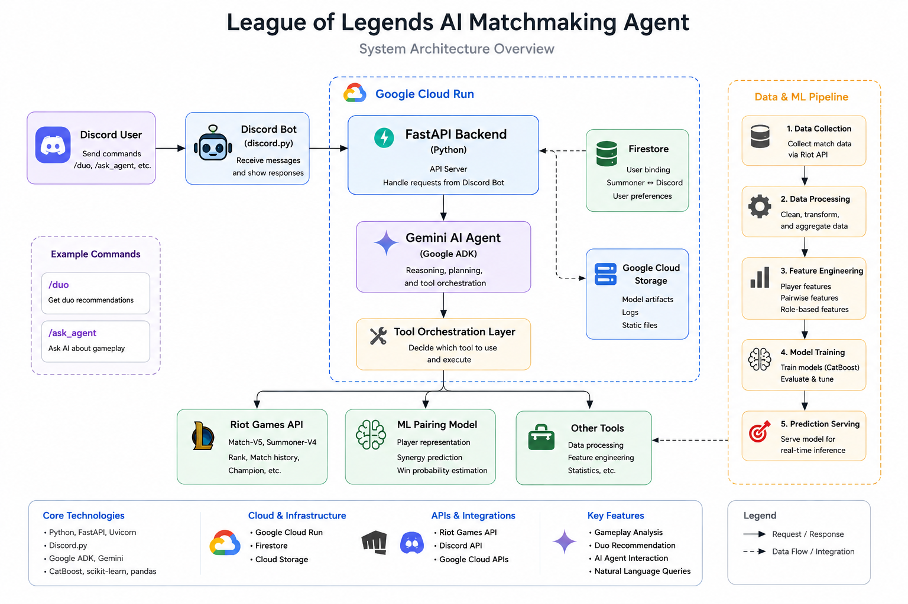
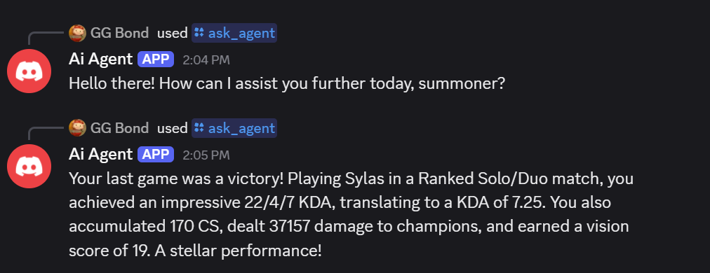
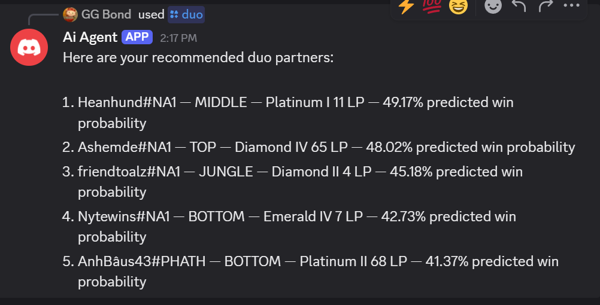

# League of Legends AI Matchmaking Agent

An AI-agent-based gameplay analysis and duo recommendation system integrating:

- LLM tool orchestration
- Riot Games API
- Machine learning-based player synergy prediction
- Discord bot interaction
- Google Cloud deployment infrastructure

---

# Overview

This project explores how AI agents and machine learning can improve multiplayer matchmaking and gameplay analysis in competitive online games.

The system combines:

- A Discord-based user interface
- A Gemini-powered AI agent
- Tool-calling orchestration
- Riot API data retrieval
- A machine learning pairing model trained on historical League of Legends match data

The goal is to move beyond traditional rank-only matchmaking by modeling player playstyle compatibility and predicted duo synergy.

---

# Core Features

## Gameplay Analysis

Users can:

- Retrieve recent matches
- Ask natural-language gameplay questions
- Generate AI-powered summaries of player performance

Example:

```text
/ask_agent analyze my last 5 matches
```

---

## Duo Recommendation System

The system predicts compatible teammates using:

- Historical player statistics
- Role-specific features
- Playstyle interaction signals
- Machine learning win probability estimation

Example:

```text
/duo
```

Returns:

- Top recommended teammates
- Predicted synergy scores
- Rank-aware recommendations

---

# System Architecture

Main components:

- Discord Bot (discord.py)
- AI Agent Layer (Google ADK + Gemini)
- Riot API Integration
- ML Pairing Model
- Firestore User Binding
- Cloud Run Deployment



---

# Machine Learning Pipeline

The ML pipeline includes:

- Match data collection through Riot Match-V5 APIs
- Player profile generation
- Pairwise feature engineering
- Role-specific interaction modeling
- Win probability prediction

Current experiments include:

- Group split evaluation
- Time split evaluation
- Role-specific feature engineering
- CatBoost-based ranking models

---

# Tech Stack

## AI / ML

- Python
- CatBoost
- scikit-learn
- pandas
- NumPy

## AI Agent Infrastructure

- Google ADK
- Gemini models
- Vertex AI

## Backend / Cloud

- FastAPI
- Google Cloud Run
- Firestore
- Google Cloud Storage

## APIs

- Riot Games API
- Discord API

---

# Future Work

Planned improvements include:

- Better player representation learning
- Real-time matchmaking optimization
- Expanded multi-match reasoning
- Friend-aware recommendation systems
- Reinforcement-learning-based pairing optimization

---

# Research Direction

This project investigates the intersection of:

- AI agents
- tool orchestration
- recommendation systems
- player modeling
- game analytics
- matchmaking optimization

---

# Demo

## Gameplay Analysis



---

## Duo Recommendation



---
